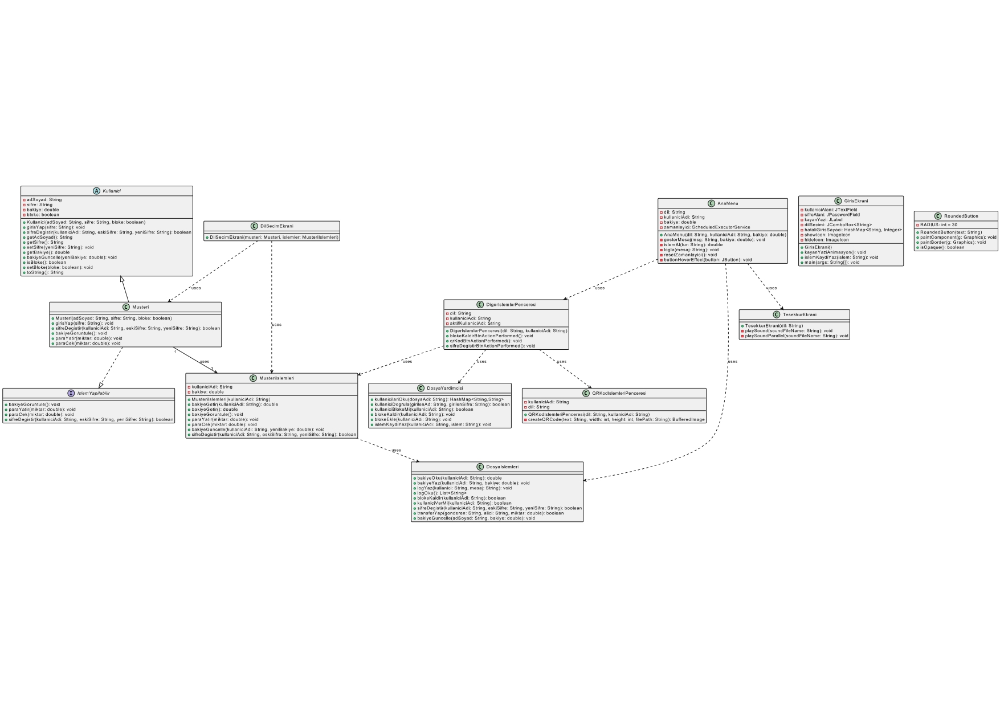

# 💳 Java ATM Projesi (OOP - GUI)

Bu proje, **Java** programlama dili ve **Nesne Yönelimli Programlama (OOP)** prensipleri kullanılarak geliştirilmiş bir **ATM Simülasyon Sistemi**dir.  

## ✨ Özellikler
- Kullanıcı girişi (dosya tabanlı doğrulama)  
- Bakiye görüntüleme  
- Para yatırma ve çekme işlemleri  
- Şifre değiştirme ve hesap bloke kaldırma  
- QR kod ile işlem desteği  
- Çoklu dil desteği  
- Sesli yönlendirme özelliği  
- **GUI (Java Swing)** arayüzü  

## 🛠️ Kullanılan Teknolojiler
- **Java (OOP)**  
- **Java Swing (GUI)**  
- **Dosya İşlemleri**  
- **UML Diyagramları**  

## 📂 Proje Yapısı
```
├── src/                # Java kaynak kodları
├── docs/               # Proje raporu ve UML diyagramları
│   ├── atmprojeraporu.pdf
│   └── UML.pdf
├── lib/                # Gerekli JAR kütüphaneleri
├── data/               # Kullanıcı verileri ve log dosyaları
└── README.md           # Proje açıklaması
```

## 📖 Dokümantasyon
- [ATM Proje Raporu (PDF)](docs/atmprojeraporu.pdf)  
- [UML Diyagramı (PDF)](docs/UML.pdf)  
- UML diyagram görseli:  
    

## 🚀 Çalıştırma
1. Projeyi klonlayın:  
   ```bash
   git clone https://github.com/dilanurdan/Java-atm.git
   ```
2. Eclipse veya IntelliJ ile açın.  
3. `src/` klasöründen **Main.java** dosyasını çalıştırın.  
# 💳 Java ATM Project (OOP - GUI)

This project is an **ATM Simulation System** developed using the **Java programming language** and **Object-Oriented Programming (OOP)** principles.  

## ✨ Features
- User login (file-based authentication)  
- Balance inquiry  
- Deposit and withdrawal operations  
- Password change and account unblock  
- QR code transaction support  
- Multi-language support  
- Voice guidance feature  
- **GUI (Java Swing)** interface  

## 🛠️ Technologies Used
- **Java (OOP)**  
- **Java Swing (GUI)**  
- **File Handling**  
- **UML Diagrams**  

## 📂 Project Structure
```
├── src/                # Java source code
├── docs/               # Project report and UML diagrams
│   ├── atmprojeraporu.pdf
│   └── UML.pdf
├── lib/                # Required JAR libraries
├── data/               # User data and log files
└── README.md           # Project description
```

## 📖 Documentation
- [ATM Project Report (PDF)](docs/atmprojeraporu.pdf)  
- [UML Diagram (PDF)](docs/UML.pdf)  
- UML diagram image:  
    

## 🚀 How to Run
1. Clone the repository:  
   ```bash
   git clone https://github.com/dilanurdan/Java-atm.git
   ```
2. Open the project in Eclipse or IntelliJ.  
3. Run the **Main.java** file located in the `src/` folder.  
